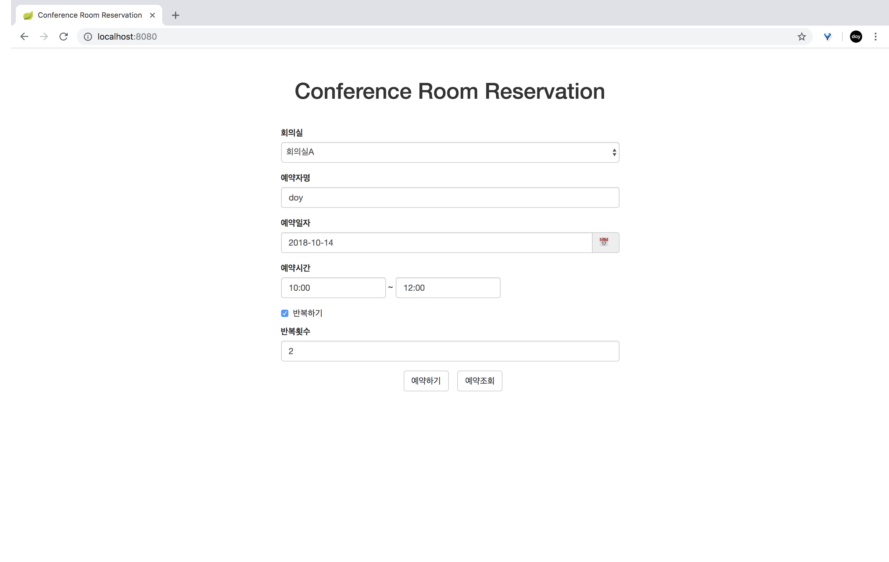
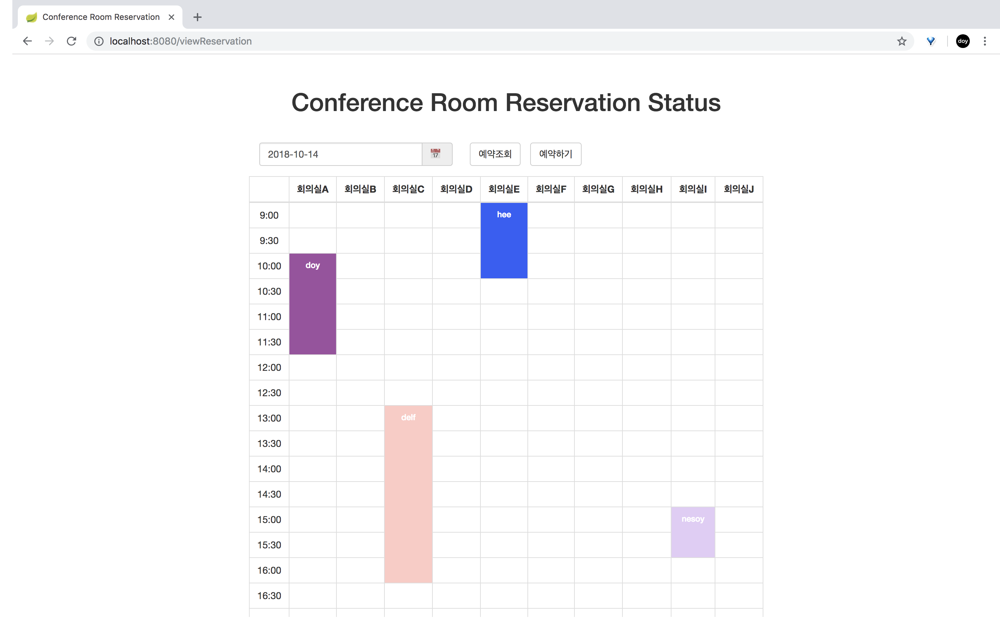

# Conference Room Reservation Service [](https://travis-ci.org/doooyeon/conference-room-reservation)

### 회의실과 날짜, 사용 시간을 입력하여 회의실을 예약하는 회의실 예약 웹 서비스

---

## Project Build & Run
- **Pre-Requirements**
    - [java](https://www.oracle.com/technetwork/java/javase/downloads/jdk8-downloads-2133151.html)
    - [git](https://git-scm.com/downloads)
    - [gradle](https://gradle.org/install/)


- **방법 1. gradle build & jar run**
    1. project clone
    ```
    ~$ git clone https://github.com/doooyeon/conference-room-reservation.git
    ```
    2. 위치 이동
    ```
    ~$ cd conference-room-reservation
    ```
    3. build
    ```
    ~/conference-room-reservation$ gradle build
    ```
    4. BUILD SUCCESSFUL 후 jar 파일 실행
    ```
    ~/conference-room-reservation$ java -jar -Dspring.profiles.active=prod build/libs/reservation-1.0.0.jar
    ```
    5. 웹 브라우저에서 http://localhost:8080/ 접속

- **방법 2. URL 접속** (AWS EC2)
    - ~~[Conference Room Reservation Service]()~~

---

## REST API
- **예약하기**
    - Request
        - **POST /reservations**
    - Response
        - OK : 예약 성공
        - BAD_REQUEST : 입력 오류
        - FORBIDDEN : 예약 중복
- **예약조회**
    - Request
        - **GET /reservations/{date}**    
    - Response
        - OK : 해당 날짜 예약 조회 성공

---

## Feature

- **예약하기**
    - 회의실 이름, 예약자명, 예약일자, 예약시간, 반복횟수 입력하여 예약
        - 회의실 : A~J
        - 예약자명 : 길이(2~10)
        - 예약일자 : yyyy-mm-dd
        - 예약시간 : hh:mm ~ hh:mm (9:00~20:00, 30분 단위)
            - validation message
                - 30분 단위로 입력해주세요.
                - 09:00~20:00 시간을 입력해주세요.
                - 종료시간은 시작시간 이후이어야 합니다.
                - 이미 예약된 시간입니다.
        - 반복횟수 : 값(2~10)


- **예약조회**
    - 기본적으로 오늘 일자의 예약 내역 출력
    - 조회할 일자 선택하여 예약조회
        - 조회일자 : yyyy-mm-dd
    - 예약 시작시간과 종료시간 사이에 예약자명 출력

---

## Troubleshooting Strategies
- **반복 예약**
    - 사용자가 입력한 반복횟수만큼 DB에 저장
    - `LocalDate plusWeeks(long weeksToAdd)` 메서드를 이용해 다음 주 날짜 세팅
- **예약 중복 체크**
    - 사용자가 입력한 예약일자와 회의실에 해당하는 예약 리스트를 DB에서 읽어옴
    - 그 리스트만큼 순회하며 중복 체크
        - 중복이 되지 않는 조건
            - 예약리스트 시작 시간 >= 예약하려는 종료 시간
            - 예약리스트 종료 시간 <= 예약하려는 시작 시간
        - 중복이 되는 조건
            - 위 조건 외의 경우
- **동기 처리**
    - 예약 저장 메서드 `synchronized` 처리

---

## Development Environment
- Language
    - Java8, HTML, CSS, JavaScript
- Back-end
    - Spring Boot
    - Spring Data JPA
    - H2
- Front-end
    - Bootstrap
    - jQuery
- Etc
    - GitHub
    - Travis CI
    - AWS EC2